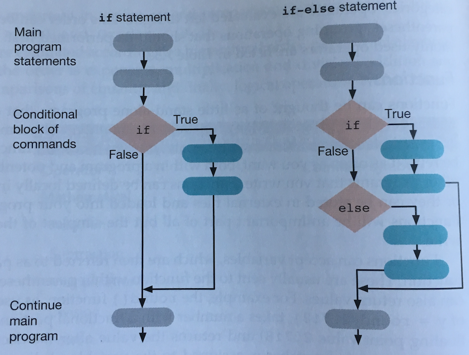
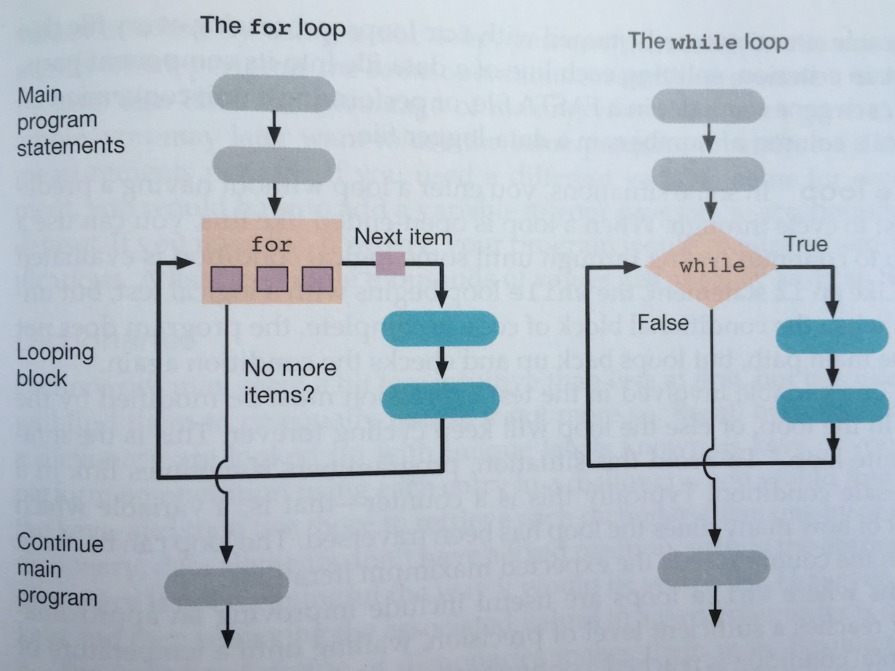

# Introduction to Python
@(Teaching)

## Goals:
- Introduction to python and programming in general terms
- Introduction to the python interpreter
- Introduction to conda
- Setting up jupter notebook on the HPC
- Survey of terms and data types in python
- Operators in python
- Lists, dictionaries, sets
- Libraries and modules
- For loops!

## What is programming?
Programming is the processes of writing a set of instructions (**program**) to tell a computer to carry out a process. The writing of the program can occur in one of any number of different languages-- however many of the key concepts are consistent.

### General types of programs
Some programming languages (e.g. C, C++) need to be **compiled**. This process takes a human readable code (source code) and turns it into less human readable (or not readable) set of instructions that can be carried out by a computer. Once compiled on a computer the code should be able to be re-run as much as you want. This is how *most* computer programs that you interactive with are run.
> Benefits: Specific to computer,
> Disadvantage: sometimes slower, less optimized

Other programming languages do not need to be compiled but rather are processed with an **interpreter**. These languages are called scripting languages (e.g. bash, Python, Matlab, R, etc.). Scripts or programs written in these languages require a program to run.

> Benefits: Modifiable,  oprtable, no need for compiling
> Disadvantage: sometimes slower, less optimized

## Why Python?

From: https://insights.stackoverflow.com/survey/2021#technology


We have selected to work with **Python** for this course.  Honestly, for science you can use whatever suits your work. Popular choices include:
- Python
- Perl
- R
- Matlab
- C/C++

Each has its merits and draw backs, but the nice thing is that once you master one language it is much easier to learn the next -- as the same general principles tend to apply. Many like teaching Python as a first language as it has a simple syntax and is fairly easy to read. What is more, Python is a fully functional language that is able to run complex tasks.

#### Python is:
-   Interactive
-   Interpreted
-   Portable
-   Modular
-  Object-oriented
-  Open access
-  Free
-  Widely used
#### Python has:
- An extensive (scientific) user base
- A large and varied set of support libraries  
- Good system of scalable tools (e.g. Pangeo)
- Good scientific notebook style interactive interface (Jupyter)

## Running Python
First things first, let's all *clone* a copy of the Repo we will be using for this part of the class. Go here: https://github.com/2023-MIT-Environmental-Bioinformatics/Lab-Python.

>
### Running the Python interpreter
Python code can be run in many ways. You can run code directly within the python interpreter. To directly open the python interpreter you can type `python`.

> You should see that your `prompt` has changed. Try typing `ls`. What happens? Why?

In `python` you can run basic commands such as basic math:

```python
>> 2 + 3

>> 4**12
```
or printing:
```python
>> print('Hello World.')
```

### Running the Python interpreter

Now, let's exit the `python` environment and try running a `python` script. To do this (just as with our bash script) we must specify the **interpreter**:

```python
python factorial.py
```
Now, let's just take a quick look at the contents of this program. Note that the *shebang* at the top of this script is different from the one used by bash. Here we are specifying that this program should be run with python 3.

> As an aside, python recently went through a major transition changing from `python 2.7` to `python 3`. While you may run into some program written in `2.7` you should try to do all of your analyses in `3`. To figure out which version you are running type `python --version` or `which python`.

### Jupyter notebooks
For the rest of this class we will be running all of our code in `jupyter notebooks`.  The main reason that I like working within in `jupyter notebooks` is that they are *interactive* and *easily readable*. Notably, code and output graphics or answers are tightly linked together rather like a laboratory notebook.

First, let's open up a new `tmux` session. You can name `tmux` sessions with the command:
```bash
tmux new -s lab
```
The magic key for `tmux` is `ctrl+B`. Here are some [useful tmux commands](https://gist.github.com/MohamedAlaa/2961058) .
#### Getting on a node
We are running everything on the HPC-- but it is common curtosy to *not* run programs, scripts, or anything time/compute consuming on the login nodes. These nodes are there for everyone to be able to navigate the file structure and do their work... not their compute. 

First, a quick reminder-- this is roughly what an HPC looks like. When you look at your prompt you should see which node you are on (`poseidon-l1` or `poseidon-l2`). You can also do `echo $HOSTNAME` to see which login node you are on. 


###### Why HPC? 
1. Software designed to work with the resources on an HPC environment and is unusable on a personal computer
2. Data is big --> HPC allows you to avoid issues with memory and to get the analysis done faster with better processing capacity (100s of cores for processing! 100s of Terabytes or Petabytes of storage! 100s of Gigabytes of memory!)
3. Parallelization is feasible! 

Our HPC uses [slurm](https://slurm.schedmd.com/documentation.html) as it

#### Anaconda
To run and manage `jupyter notebooks` we will be using `anaconda`.  Anaconda is a free and open-source distribution of the Python and R programming languages for scientific computing. Through the function `conda` Anaconda facilitates the installation of python and R programming languages as well as packages. It is a great tool for ensuring that computational environment is associated with code and really streamlines program installation and use.

The first thing we are going to do is load anaconda on to our compute environment on the HPC. To do this we will use the command:

```bash
module load anaconda
```

> The `module load` is a common aspect of HPC environments. Try typing `module avail`. This prints all the available programs that you can load on the HPC. Many of the programming languages we already mentioned are listed. Type `module list` to see what programs are loaded in your environment.

Now that we have loaded anaconda the first thing we are going to do is create a new `conda environment`. A `conda environment` is a type of virtual environment. Virtual environments helps to keep dependencies required by different projects separate by creating isolated spaces for them that contain per-project dependencies for them. Basically, you can think of it as having a special room (environment) within your house (computer) where you do one specific activity. For example, in the kitchen you cook, in the bed room you sleep. Only with virtual environments you can be even more specific. It is good practice to associate environments with computational projects as you are able to specify things like program versions within them. Hypothetically, with conda you should be able to hand a friend an `environment.yaml` file and all your code and data and they should be able to run everything. It is pretty transformative, really.

You can read more about `conda` environments [here](https://docs.conda.io/projects/conda/en/latest/user-guide/tasks/manage-environments.html).

For now, let's make our first conda environment. I have provided a  yaml file that contains the packages we might available during our lab.  Let's take a quick look at it. `less lab.yaml`. Now type or copy:

```bash
conda env create -f lab.yaml
```
Note: If this is your first time using conda envrionments on the HPC you might need to run the following command. Note: you only need to run *once* and then it should be set.

```bash
conda init bash
```

This is going to create a conda environment called `python-lab`. Whenever we activate `python-lab` it will take us into that special room on our computer where all these programs are installed with specific versions. To enter it type:

```bash
conda activate python_lab
```
> What happened to your prompt?

### Starting Jupyter Notebook
Now, we are reading to start a `jupyter notebook`! Jupyter notebooks run within a web browser and act as a GUI interface of sorts to run python code. Yet, they are saved as convenient chunks of code (ending in `.ipynb`) that can be opened again,  re-run, shared, and modified.

If you were working on your local computer you could simply type `jupyter notebook` and a notebook would open up. However, as we are trying to run this on a remote computer we will need to specify a bit more. First, we are going to set a password for our `jupyter notebooks`. Jupyter notebooks basically create a port into whatever computer you are using (especially if it is a remote machine). You only have to do this once (or whenever you want to change you password). Note: you only need to run these commands *once* and then it should be set.

```bash
jupyter notebook --generate-config
jupyter notebook password
```

Now, let's open jupyter notebook!

```bash
   jupyter notebook --no-browser --port=8888
```
This command tells the computer that we want to start a jupyter notebook -- but that we DON'T want it to try to automatically open a browser. This is because there is no browser on the HPC.

To access the browser we are going to use `ssh`.  You will need to know the following information:

1. Your username
2. Your password for the HPC
3. Your password for jupyter notebooks (that we just set)
4. The `port` that we opened jupyter within
5. The name of the node you want to open the notebook on `poseidon-l1` or `poseidon-l2`.

Now, we will use the command. Type this into a new terminal window that is running on your local computer:

```bash
ssh -N -f -L localhost:8888:localhost:8888 USERNAME@poseidon-[l1 or l2].whoi.edu
```
This should prompt you for your password. You can enter it and then hit enter. Once you do that, you are ready to open your browser of choice and type `localhost:8888` into the prompt. Now, enter your jupter notebook password. Hit enter-- and you should be ready to go!

## Let's take a quick tour of Jupyter!

Jupyter is an interactive way to visualize code, the output of code (e.g. plots), and keep notes.  The first screen you see is the home screen or dash board. This should show you a navigable file structure much like what you might find on your computer.

Jupyter (a mash up of Julia-Python-R) is a pen-source web application that allows you to create and share documents that contain live code, equations, visualizations and narrative text. The power of Jupyter is that it can be set up to run any number of code interpreters. This can be done by selecting a different "kernel". These notebooks can be shared, downloaded, posted to websites, turned into pdfs... the options are basically endless. They can even be viewed on Github!  

Let's start a new notebook. Go over to `New`  drop down menu and select `Python [conda env:conda-python_lab]` or the like. This is going to open up a new Jupyter Notebook within our special `conda` environment for us to work within.

> **Quick tip:** if you are lost or confused just type H (while not in a cell). This brings up a handy cheat sheet.  

You should now see a new Jupyter Notebook window.

## Terms and data types

### General terminology

| Term       	| Definition                                                 	|
|------------	|------------------------------------------------------------	|
| Arguments  	| Values given to a program when it is run                   	|
| Code       	| Program or or portion of program; Act of writing a program 	|
| Execute    	| To begin to run a program (see also: run)                  	|
| Function   	|  A subprogram that can be called to run the same task      	|
| Parameters 	| Values given to a function                                 	|
| Return     	|  The act of sending back a value as part of a function     	|
| Variable   	| A name that holds a value                                  	|

### Basic data types
| Type       	| Example                                                 	|
|------------	|------------------------------------------------------------	|
| Integer  	|A whole number; e.g. 85, 0                   	|
| Float       	| Any number (scientific, decimal); e.g 3.14, 4.2e-10 	|
| Boolean    	| Binary True/False                	|
| String   	| A collection of text characters (numbers, letters, etc.); e.g. "Homo sapiens", "33" 	|

### Mathematical Operators
| Symbol | Example                                                 	|
|------------	|------------------------------------------------------------	|
| `+`	|Addition                   	|
| `-`         	| Subtraction|
| `*`      	| Multiplication             	|
| `/`     	| Division|
| `**`     	| Power/exponent|
| `%`     	| Modulo|
| `//`     	| Truncated division (without remainder)|

### Comparative and Logical Operators
| Symbol | Example                                                 	|
|------------	|------------------------------------------------------------	|
| `==`	|Equals                   	|
| `!=`         	| Does not Equal|
| `>`, `>=`      	| Greater than             	|
| `<`, `<=`     	| Less than|
| `and`, `&`    | And|
| `or`, <code>&#124;</code>	| Or|
| `not`, `!` 	| Not|


## Variables as containers of many things
###  Variables at their most basic
Unlike some other programming languages, you do not need to specify what a variable is going to be. It can honestly be anything and will take on anything. Any data type can be assigned to a variable with the `=`. For example:

```python
my_name = 'Harriet'
blue = 'red'
apple = 5
```
You can `print` the value of a variable with the command `print()`:

```python
print(my_name)
```

Variables must be created before they are used. If for example I wanted to print a variable called `elephant` I would need to initiate it first.

> What happens if you try to print a variable that hasn't been set up yet?

What is more-- variables persist between calls (until they are actively changed by assigning a new value). So, when you set a variable in one cell it is going to be the same further down.

Variables can also be used in any calculation you want. For example,

```python
favorite_number = 24
favorite_number_squared = favorite_number ** 2
```
You can also take information and pass it into another text string that is printed:

```python
print("My favorite number is" , favorite number, "that number squred is:", favorite_number_squared)
```
Also, variables that contain strings can be indexed and sliced to grab particular parts. Let's make a long string:

```python
bronte = 'Whatever our souls are made of, his and mine are the same.'
bronte[2]
bronte[3:20]
```
###  Libraries
What is more, we can search in strings using our good, old regular expressions. To do this we will import a **library** or **package** into python. Python has a lot of utility on its own-- however not everything is automatically available. Most of the coolest functionality are compartmentalized into packages.

The first one we will try out is called `re`. In a cell type: `import re`. You will now be able to use all the functionality within that function. You can call functions (tools) within this package using the dot. For example we can search for the regular expression `'\s[A-z]+a[rmd]e'` in `bronte`.

```python
re.findall('\s[A-z]+a[rmd]e', bronte)
```
Try typing `re.` and hitting tab-- you will be able to see the different tools in this package.

### Variables with Arrays, Lists, Dictionaries, and Sets
#### Lists
An `array` is a collection of data that is called by a single variable name.

A `list` is a 1D array that contains a series of values. List variables are declared by using brackets `[ ] ` following the variable name. Values do not need to be of the same type (i.e. you can have a mixture of strings, integers, floats, and booleans). You can also have `list` contained within a `list`. Lists are always ordered (once you set the order)

Let's try making a `list` that contains your favorite number, letter, and fruit:

```python
Favorite=[42, 'Q', 'kumquats']
```

`arrays` and `lists` can be indexed -- meaning that you can ask `python` to return only the value at one particular location. As such, `lists` and `arrays` are necessarily ordered. Python is zero indexed (meaning that counting starts at zero rather than 1).

So, if I wanted to return the 2nd element of `Favorites`:

```python
Favorite[1]
 >> 'Q'
```
Some functions can directly modify lists for example:

```python
primes = [2,3,5]
```
We can use `list_variable.append` to add items to the end of a list. `.append()` is a *method* of lists. Methods are liked functions but are tied to specific function types. For example, you cannot apply the method `.append()` to anything but a list - it will not work.

```python
primes.append(7)
```

> What happened? Did anything print? What happens if you try primes.append(11)? What if you try to append two numbers?

> What happens if you try to append to our previous string `my_name`?

#### Arrays
Generally, I do not recommend working with arrays for anything other than numeric data. One of the options for working with numeric data is the package `numpy` (Numerical Python... there is debate about [pronunciation](https://www.reddit.com/r/Python/comments/2709pq/how_do_you_say_numpy/)). Let's import `numpy`. In a cell type:

```python
import numpy as np
```
Unlike `re` numpy is kind of long. For longer named packages it is common practice to import them to a shorthand name with the word `as`. Here we are importing `numpy` as a variable named `np`. If you then type `np` it will automatically pull up numpy.

Let's create a matrix!

```python
x_lists = [[1,2],[3,4]]
arr = np.array(x_lists)
```
I am not going to go into the matrix math application of python here-- but if you are interested I recommend checking out `numpy` and `xarray`. More [here](https://www.python-course.eu/matrix_arithmetic.php).

You can also read in data from a file like a csv. For example:

```python
data = np.loadtxt('data/random.csv',delimiter=',')
```
In addition to reading reading in data you can also perform simple (and more complex) mathematical operations. For example, we can use the function `sum()` within numpy to calculate the sum of the numpy array:

```python
np.sum(data)
```
You can also use the `help()` much like man to investigate the use of functions. For example:
```python
help(np.sum)
```
Of course, you can also google the function and find out what it does.
> Can you figure out how to calculate the mean? Standard deviation? Median?

#### Sets
 `Sets` in python look a bit like lists at first, but they serve a different purpose. `sets` are a collection of unordered collections of unique elements-- this means that more than one of the same item cannot occur and that `sets` cannot be indexed. So, why would you want to use them? Well, they end up being very useful if you ever want to identify if something is present in a group or identify what the unique members of a group are. Sets are made using the function `set()`.

For example,

```python
colors = ['blue', 'blue', 'red', 'green']
uniquecolors = set(colors)
```

More to our interests:

```python
sequence = "ATCTTAAGTT--AAA"
set(sequence)
```

> Sets have some really powerful `methods` associated with them. For example,  you can rapidly run math-like set comparison with `.union()`, `.intersection()`, `.difference()`.  Try running these commands with the sets defined below.

```python
	begin_in_A = set(['apple', 'ashen', 'architecture'])
	end_in_E = set(['stare', 'bane', 'apple', 'frazzle'])
```

#### Dictionaries
A dictionary (sometimes called a hash or map in other languages) is a different type of container. It is much like it sounds-- it is a dictionary. As with a paper dictionary, where you look up a `word` and get a `definition` (or multiple `definitions`), a dictionary will take a `key` and look up any associated `value`.  Values can be anything that you can store to a variable: `strings`, `lists`, `sets`, other `dictionaries`. Dictionaries can be as simple as associating one `string` with another `string` or can be much more complicated.

You can initiate a dictionary with `{}`:

```python
fact_dict = {}
```
Then, similar to how we indexed our list and arrays, we can use the `[]`to call or add values to our dictionary.

```python
fact_dict["name"] = "Harriet"
fact_dict["age"] = 32
fact_dict["favorite_foods"] = ['avocado', 'sourdough', 'raspberries']
```

You can then `print()` your dictionary:

```python
print(fact_dict)
```
And we can recall values from our dictionary:

```python
print("My name is", fact_dict["name"], "and I like", ', '.join(fact_dict["favorite_foods"]))
```

> **Exercise** : Write a dictionary that matches bases that typically pair in DNA: (i.e. A and T; C and G). This dictionary should allow us to query with one base and then get back its pair. Call this dictionary `comp_dict`.  

## Flow Control: Loops and beyond!

### `for` loops over strings and lists
As mentioned before-- `for loops` are a consistent programming element across languages. We learned the style of for loops in `bash` so now let's learn about them in `python`.

In `python`, `for` loops take the general form:

```python
primes = [2,3,5]
for num in primes:
	print(num)
```
> What are the differences you can see? What would let you know something isn't in the loop?

Unlike bash, `python` formatting relies a lot on the presence of white space to define different components of a program element. In python the for statement is always followed by a ':'. Then, anything following this `:` must be tabbed over and anything occurring within this textual block will be considered to be part of the thing to be looped over.

For loops can loop over any of the sets we defined above : lists, strings, etc.

Let's try writing a for loop that will loop over a string. We just wrote a dictionary above that will generate the complement of a single base pair. Let's define some sort of sequence that we want to find the complement of:

```python
sequence = "ACTGCTAGG"
```

We  can't pass a whole sequence directly to the dictionary. It won't work.

```python
comp_dict[sequence]
###DOESN'T WORK!
```
> **EXERCISE TOGETHER:** Instead, we can write a loop that loops over each element of the string and then queries that element in our dictionary. Let's write a for loop that will loop over a string and output the complement of that string.

### Looping over files in our directory
Often, something we want to do is loop over a list of files and do the same thing for each of the files. What if we wanted to loop over all the files that end in `.csv` like we did in bash.

In `bash` we could do:

```bash
#bash
for file in *csv
do
	...
```

 In python we can use the library `glob`. In Unix, the term “globbing” means matching a set of files with a pattern-- and that is what this function does. This library allows you to search within your file structure using wildcards or regular expressions like those we have already learned. First, we have to import it:

``` python
import glob
```
We can then check all the files that in in `*csv` within a particular directory like this:
```python
print('The csv files are:', glob.glob('newdata/*.csv'))
```
Now, let's pass this command to a for loop and see what we can do! Let's write a for loop that will read in all the `csv` files to arrays with python:

```python
for f in glob.glob('newdata/*csv'):
    f_array = np.loadtxt(f, delimiter=',')
```
What is the value of `f_array`? What is happening?

> Add a command to this function that will calculate and print the mean of this array to the screen with a message.

### Decisions with `if` and `else`
Often times in programming you have the computer make decisions for you. You want to do one thing to one set of files and something different with the other set. The `if` statement is the most commonly used technique for such decision making. You can think of it is as a fork in the road: based on a binary `True`/`False` choice at this fork you will do one thing or another.


**Figure 7.3 from Practical Computing for Biologists, Haddock and Dunn.**

If statements can be very simple. They are encoded with the the keyword `if` and a `:` as with `for` loops. `else`, when added gives the option for what to do if the first statement is not true. For example, to test if a number is even you might use the following:
```python
A = 51
if (A %2)==0:
	print('Even')
else:
	print('Odd')
```

Now let's embed this into a for loop.

Let's modify the loop that we wrote above to work on reading in files from a directory with `glob`:

```python
for f in glob.glob('newdata/*csv'):
    f_array = np.loadtxt(f, delimiter=',')

```
>Let's say that we want to save all the arrays that have a mean greater than 0.5 to a dictionary called 'big' and those less to a dictionary called 'small'. How can we do that?

### A different type of loop: `while`
Sometimes you enter a loop with an idea of all the things you want to do-- i.e. you have a list of things you want to analyze or change.

Sometimes, however, you don't have an exact list of things you want to accomplish but rather have an idea that you want to do something until a particular condition is met. This is often done with some sort of counter or monitor. A note: it is possible to end up in an endless while loop if you don't have a condition that can ever be met!


**Figure 7.4 from Practical Computing for Biologists, Haddock and Dunn.**

While loops are useful if you need to improve an approximation, or want to wait until some condition is reached, or if you are reading a file and want to read it while the file has lines.

While loops generally take a conditional statement (much like `if`/`else` ) and take the general form:

```python
i = 1
while i < 100:
	print(i)
	i+=12
```

## Functions

We have just written code to read in a file and parse it to retrieve the different elements of the fasta file. What if we wanted to do the same thing, but with a different file? Say we wanted to now run the same code on `griffin.fa`. Well, we could copy and paste the code and change the filename at the top. This is probably okay once but you can easily see how this might lead to massive amounts of code that is redundant and difficult to comprehend.

Functions allow you to get around this. We have already used functions (e.g. `np.sum(array)`) is a function that takes an array as an input and returns the value of the sum. We also saw how it can take parameters like `axis=0` to sum just the columns of the array. So, rather than manually copying and pasting the code that sums an array we can simply use a function.

Beyond the realm of libraries -- you can create custom functions within python. Custom functions allow you to write more complex and longer code blocks but in more human comprehensible ways. Functions can ultimately serve as shorthand for a larger and more complex process-- encapsulating complexity withing a single key word. Moreover, functions enable re-use so you only have to write a function once-- but can reuse it forever.

### Writing custom functions
To do write functions in python we use the term `def` which is short for definition. `def` is followed by the name of the function that you are writing. As with `for` loops etc. above, white space is used define the code block that will be included in the function.

```python
def sayHello():
	print("Hello, there.")
```
> Simply *defining* a function does not run it. Note, if you paste this into a cell in Python nothing will be printed. To execute a function you must call it by typing `sayHello()` somewhere else.

### Parameters and returning output
The real use in functions is the ability to apply the same set of commands to some new variable or value. For this, we can pass a parameter to the function. After the function you have a set of parentheses after which you can list all the *parameters* that should be passed to the function. So for example, we can modify the above function so that it says hello to whoever we want:
```python
def sayHello(input):
	print("Hello,", input, "!")
```

More than one parameter can be passed to a function-- multiple values can be passed to a function with commas. For example, we can make a simple function called `addx` that takes an input value and adds a number (x) to it and assigns the value of the two to a new variable `output`.

```python
def addx(input, x):
	output = input + x
	print(input, 'plus', x, 'equals', output)
```

> Try running this function with any two numbers. What is the value of `output`?

You shouldn't see any value automatically assigned to output? Why? Well, it has to do with the *scope* of a variable. Let's consider the following:

```python
bignumber = 10506010
def addx(input, x):
	output = input + x
	print(input, 'plus', x, 'equals', output)
```
- The variable `bignumber` is a *global variable*. This means that it was defined outside of a function and can be viable (accessible) everywhere (globally).
- The variables `output`, `input`, and `x` are *local variables* within the function `addx`. These variables are only accessible within the function `addx` and do not get added to the global namespace.

Broadly, you can think of this as variables defined within a function have a scope only within that function. Variables defined outside of a function are accessible throughout.

So, what if you wanted to do something with the variable `output` from `addx`? Any variable that you want to access from a function has to be returned to the global name space. This can be done with `return`.

```python
def addx(input, x):
	output = input + x
	print(input, 'plus', x, 'equals', output)
	return output
```
Now, if we run:
```python
addx(bignumber, 20)
```
We will see that in addition to printing what is being done the sum of `bignumber` and 20 has been printed to standard out. To assign that value we can use the `=`:
```python
biggernumber = addx(bignumber, 20)
```
> **Exercise**: Write a function that will read any fasta file and parse it into a dictionary using the code that you we wrote at the beginning of class. Integrate this function into a for loop using `glob` that will read in all fasta files within a dictionary.


### Making functions flexible

By default our function `addx` requires two inputs: `input` and `x`. What happens if you only pass one input (e.g. `addx(5)`)?

You can make functions more flexible by providing default values for parameters. This can be done by assigning a value to the parameter in the definition of the function:

```python
def addx(input, x=0):
	output = input + x
	print(input, 'plus', x, 'equals', output)
	return output
```
Here, we set the default value of x to be 0.

> Test this out. What happens if you try running `addx(5)` now? What about `addx(5, 6)`?

In addition to setting a default value for a variable you can also set the  default variable to be the built in value `None`. `None` in python signifies 'empty' or 'no value'. Often it is used in functions to indicate that a value is not required for the function. For example take a look at `help(np.sum())`.  `None` is used to indicate parameters that are optional (e.g. `sum(a, axis=None, dtype=None, out=None`). You can choose to pass a value or not and the function will still work.


## Reading and writing files
### Reading
As with everything, there is more than one way to read in files to a readable format in python. Above, we used the package `numpy` to read in a `.csv` file into a numerical array that can be used in python. While built-in functions are convenient for reading in prescribed file types-- often you will encounter unique file types that don't have a standard parser in python.

Therefor, it is useful to know how to manually read files in to a readible python format. Generally speaking, files are read into python by iterating over all the lines in the file.

To begin, you always need to open a text file:

```python
filename = 'data/fasta/unicorn.fa'

with open(filename, 'r') as f:
	for line in f:
		print(line)
f.close()
```
> What do you notice about how the line is printing out?

Here we are using the `open()` function to open a file as readable (`r`) for python. We are then using a for loop to loop through the file.  Each line is automatically provided to us as a `str` type.

> **Useful methods for strings:**
> - `.strip()`: strips white space off the ends of a string
 >-  `.split()`: splits a string based on a provided delimiter
 >-  `.count()`:  counts the number of occurrences of a character within a string
 >-  `.join()`: joins the elements of a list with a specified string
 >- `.startswith()` and `.endswith()` returns a boolean testing if a string starts or ends with a specified character or set of characters
 >- `.replace()` replaces a specified character or set of characters with another character

#### Exercise break: fasta files to dictionaries
Now, let's modify the above statement that will create a dictionary of dictionaries called `mysequences` that has a key for each new fasta entry in our fasta file (e.g. `Unicorn1`). Each of those name keys should then point to a sub dictionary that has the values:  		
- `sequence`: the complete fasta sequence
- `header`: the complete header filed
- `name`: just the first element of the header without the ">"

**Some things to consider:**
- The sequences are broken up across multiple lines. How can you make sure that you are getting the full sequences and not just the first or last line?
- How do you make sure that you are associating the correct fasta sequence name with the correct fasta sequence?

**Bonus**:

- Make each of the fields in the header (e.g. `location`) their own key in the sub dictionary.
- Add a field to the sub dictionary (`length`) that has the length of the sequence in it.
- Add a field to the sub dictionary (`gcfreq`) that has the GC frequency of the sequence.
- Add a field to the sub dictionary (`comp_seq`) that has the  complement of the original sequence.

### Writing
So, now that we have *parsed* our fasta files-- let's write it out to a new format. Just as with reading, we can do this by looping through our information and writing our file line by line. Let's pretend we want to write these out to a new file format that is tab-delimited and takes the form:

> `sequence_name` `<tab>` `header_info` `<tab>` `sequence_length` `<tab>`	`sequence`

First, we need to use the `open()` command as we did above to initiate the file object. Here, instead of using `'r'` for read we can choose to use either `'w'`, write, or `'a'`, append. These are roughly analogous to the `>` and `>>` in bash that we learned earlier.

```python
outfilename = 'unicorn.newformat'
with open(outfilename, 'w') as f:
	f.write('hello')
f.close()
```
The above just wrote 'hello '. We can modify the above code block to loop through our dictionary adding each sequence entry in turn:

```python
outfilename = 'unicorn.newformat'
with open(outfilename, 'w') as f:
    for key in mysequences.keys():
        sdict = mysequences[key]
        outlist = [sdict['name'], sdict['header'], str(len(sdict['sequence'])), sdict['sequence']]
        f.write('\t'.join(outlist))
f.close()
```

#### Exercise
Write a set of commands that will write out the complement of each of the fasta sequences to a new file called `unicorns_complement.fa`. The header should contain all the information that the old header contained. Make sure that each header line starts with a `>`.


## Defensive programming
As a programmer it is important to assume that there will be errors. Human errors in input, errors in how a function is used, etc. One powerful thing you can do is attempt to guess how and where a function might be misused. One way you can do this within python is with `assertion` statements. Assertion statements will check to make sure some condition is true-- and will raise a warning and break the program if it is not. Assertion statements take the general form:

```python
assert <CONDITION>, <ERROR MESSAGE>
```
If the value of the condition is true, the program or function will continue without pausing -- if it isn't true an error message will be raised. Generally, this is  a nice way to highlight ways in which the function is not being used properly.

For example, let's say we were writing a function that did division and not addition. We would want to make sure that the user isn't trying to divide by 0. We can use an assertion statement for that.

```python
def dividex(input, x):
	assert x!=0, "You cannot divide by zero."
	output = input / x
	print(input, "divided by", x, "equals", output)
	return output
```

> Test it out. What happens if you try to divide by zero?

Generally, it is useful to use assert statement to check that the input type is correct (e.g. `type(x) is int`) or that it fits your requirements.

> **Exercise** You have been provided with the standard codon look up table. Write a function that will read in the codon look up table to a dictionary. Then write a function that will translate any provided DNA sequence into an amino acid sequence. Use an assertion statement to make sure that only ACTG's are allowed as the sequence input.

## Writing command line applications in python

 Jupyter Notebook and other interactive tools (e.g. working within the python interpreter) are great for testing and developing code and exploring data, but it is likely that sooner or later we will want to use our program in a pipeline or run it in a shell script to process thousands of data files. In order to do that, we can make our programs work like other command line tools.

The library `sys` can be used to take and parse input from the user. `sys.argv` stores a list of all command line input from a user. `sys.argv[0]` is always the name of the function and `sys.argv[1]` is the first user input.

So, for example let's look at the simple function `sayhello.py`.

Now let's take a look at the slightly more complex `factorial.py`.

Running a Python script in bash is very similar to importing that file in Python. The biggest difference is that we don’t expect anything to happen when we import a file, whereas when running a script, we expect to see some output printed to the console.

In order for a Python script to work as expected when imported or when run as a script, it is considered good practice put the part of the script that produces output in the following if statement:

```python
if __name__ == "__main__":
	function()
```

This allows python scripts to be both imported as libraries and to be executed on the command line seamlessly.

When you import a Python file, `__name__` is the name of that file. However, when running a script in bash,` __name__` is always set to `'__main__'` in that script so that you can determine if the file is being imported or run as a script. Thus, if you execute a script from the command line it will default to running what is below the if statement.

## Useful customization for after class
There is a lot of typing involved in getting jupyter running on the HPC. I recommend that you add the following function to your `.bash_profile` on the HPC.

```bash
 jpt(){
   # Fires-up a Jupyter notebook by supplying a specific port
   jupyter notebook --no-browser --port=$1
}
```

As you can see the command `jpt` takes one user input $1 which specifies the port number that you want to open your `jupyter notebook` in.  So, to open a port you would type `jpt 8888'.

Now, on your *local* `.bash_profile`. Here you will also benefit from adding a small function to make your life easier. You should change USERNAME to your username

```bash
function jptwhoi(){
    # Forwards port $1 into port $1 on your local and listens to it. $2 is the login node you are on.
        ssh -N -f -L localhost:$1:localhost:$1 USERNAME@poseidon-$2.whoi.edu

}
```

Eventually we will want to run these on individual compute nodes through the slurm submission system. So, good to add this function as well:

```bash
function jptnode(){
    # Forwards port $1 into port $1 locally and listens to it. $2 is the node name (usually pn##).
        ssh -t -t USERNAME@poseidon-l1.whoi.edu -L $1:localhost:$1 ssh $2 -L $1:localhost:$1
}
```
